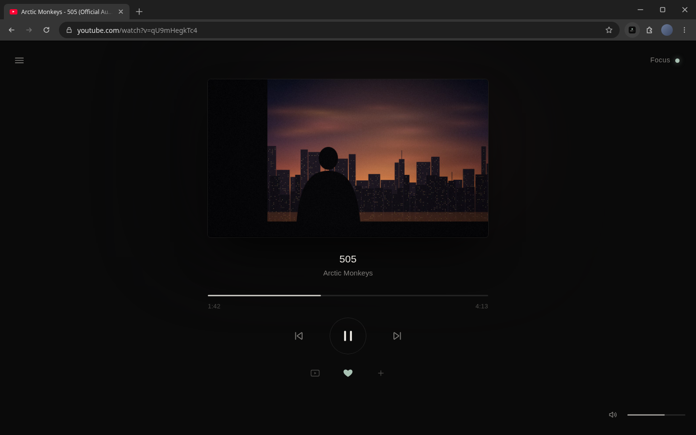
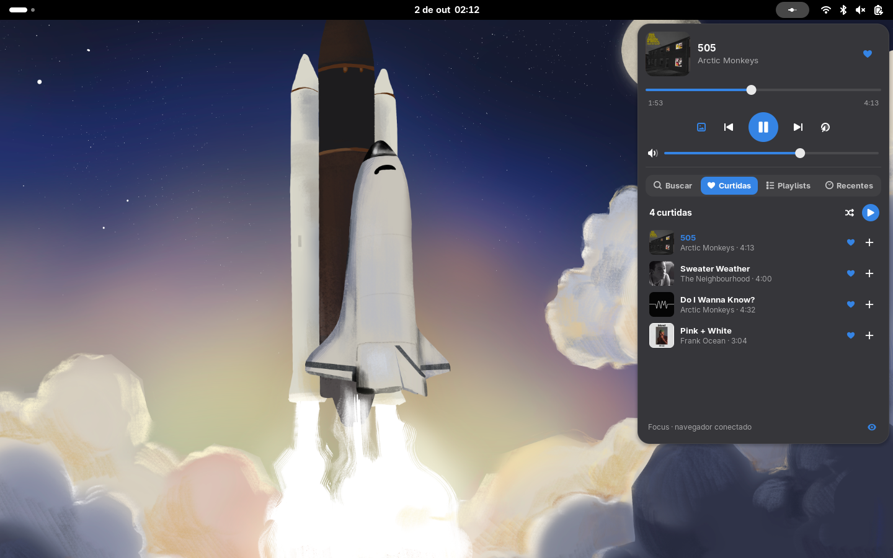

# Focus

> Abra o YouTube. Dê play na música. Pare de navegar.

Extensão do Chrome (Manifest V3) que transforma a página de vídeo do YouTube num player de música quase vazio: o vídeo pequeno no centro, título, artista, uma barra de progresso fina, `‹ II ›`, um ♡ e o volume. Todo o resto some.



Não é um serviço de streaming nem um clone do Spotify. A reprodução continua sendo **do próprio player do YouTube**. A extensão é só uma camada visual e de comportamento por cima da página: nada é baixado e nada é removido do DOM.

## O que fica na tela

| | |
|---|---|
| Vídeo | O `#movie_player` real do YouTube, reduzido (máx. 560 px) e centralizado |
| Música | Título e artista, extraídos de "Artista - Música (Official Video)" |
| Controles | anterior · play/pause · próxima, barra de progresso, tempo atual / duração |
| ▢ / ◎ / ☾ | Vídeo: ligado → só a capa → escuro (clique alterna; também em Ajustes) |
| ♡ / + | Curtir; adicionar a uma playlist local |
| Volume | Discreto, no canto inferior direito (aceita roda do mouse) |
| `☰` | Menu minúsculo: Buscar · Biblioteca · Curtidas · Playlists · Ajustes |
| `Focus ●` | Liga/desliga o modo Focus (também `Alt+Shift+F` ou clicando no ícone da extensão) |

Com o vídeo desligado (capa ou escuro), a capa do YouTube (`maxresdefault`, com fallback para `hqdefault`) ou um fundo preto cobre o player. O áudio continua tocando, e o Focus pede ao player a menor qualidade de vídeo (`tiny`) para economizar banda. Ao religar, volta para a qualidade anterior. Durante anúncios a cobertura sai, para o botão "Pular" ficar acessível.

Com o mouse parado e a música tocando, os cantos e os controles somem e fica só o vídeo, o título e a linha de progresso.

## O que o modo Focus esconde

Feed da home, recomendações, vídeos relacionados, comentários, Shorts (`/shorts/ID` vira `/watch?v=ID`), sidebar, masthead, notificações, cards e telas finais com sugestões, overlay de pausa e promoções ("Experimente o YouTube Music/Premium"). Diálogos necessários do YouTube, como consentimento e "Ainda está assistindo?", continuam funcionando.

Fora do `/watch`, a home do YouTube vira um campo de busca e uma linha "Continuar · última música". A página de resultados vira uma lista só de texto (título, artista, duração), sem thumbnails. Páginas de conta e configurações passam sem alteração.

## Anúncios (portado do yt-ads-sucks)

`src/ads.js` / `src/ads.css` são o [yt-ads-sucks](https://github.com/alphachief13/yt-ads-sucks) v1.2.0 integrado à extensão:

- silencia o anúncio e depois restaura o mute anterior do usuário;
- cobre o anúncio com uma tela preta, mantendo o botão "Pular" e a contagem do YouTube clicáveis;
- acelera o anúncio (16×) e clica em "Pular" sozinho assim que o YouTube libera;
- tem um botão "Mostrar anúncio" para quem quiser ver.

Cada uma dessas três funções pode ser desligada em **Ajustes**. Durante um anúncio, a linha do tempo do Focus mostra `Anúncio · pulando` e o tempo restante, e a barra fica bloqueada para seek. Isso funciona com o Focus ligado ou desligado, igual à extensão original.

## Biblioteca local

Tudo fica em `chrome.storage.local`. Nada sai do navegador.

- `songs`: `{ [videoId]: { id, title, artist, channel, thumb, duration, liked, likedAt, playedAt } }`
- `playlists`: `[{ id, name, ids: [videoId], createdAt }]`
- `recent`: até 50 IDs, do mais recente para o mais antigo
- `settings`: `focus, videoMode ("video" | "cover" | "dark"), autoHide, ambient, adMute, adBlackout, adSkip, desktop`

A biblioteca só aparece quando você abre o painel pelo `☰`. Tocar uma música a partir de Curtidas, de uma playlist, de Recentes ou da busca usa aquela lista como fila: `›` e o fim da faixa vão para a próxima da lista. Sem lista, `‹ ›` usam a playlist ou o "a seguir" do YouTube. Em **Ajustes** é possível exportar e importar a biblioteca em JSON (a importação é validada e mesclada com o que já existe).

## Painel do GNOME (opcional)



Uma versão do yt-pod que espelha o Focus em vez de tocar o YouTube Music por conta própria. O ícone fica no painel superior e mostra a música da aba do Focus. Pelo menu dá para usar:

- tocar/pausar, anterior/próxima, progresso e volume;
- ♡, curtidas, playlists e recentes (a mesma biblioteca do navegador);
- busca no YouTube, sem mexer na aba;
- modo de vídeo (vídeo/capa/escuro) e Focus liga/desliga.

O clique do meio no ícone toca/pausa e a roda do mouse muda o volume. Tocar algo pelo painel navega a aba do Focus, ou abre uma se não houver.

É **escolhível**: vem desligado, e o Focus funciona igual sem ele, em qualquer sistema. Para ligar:

1. `gnome/install.sh` instala o host de native messaging (Chrome, Chromium, Brave, Edge, Vivaldi) e a extensão do GNOME Shell (48–49), e já a deixa marcada como ativa. Ele não usa `sudo` e só mexe em `~/.local/share`, `~/.config/<navegador>/NativeMessagingHosts` e na lista de extensões ativas do GNOME. O ID da extensão do Chrome é calculado pelo caminho desta pasta; se for outro, passe como argumento (`gnome/install.sh <id>`).
2. No Wayland, saia e entre de novo na sessão **depois** de rodar o script: o GNOME só carrega extensões novas no login.
3. Em `chrome://extensions`, recarregue o Focus (a versão com o painel pede a permissão `nativeMessaging`) e depois recarregue a aba do YouTube.
4. No Focus: `☰` → Ajustes → **Painel do desktop (GNOME)** → ligar. Logo abaixo aparece "Conectado ao painel do GNOME", ou o que falta.

```
aba do YouTube (focus.js) ⇄ service worker (desktop.js) ⇄ focus-host.js (GJS) ⇄ D-Bus ⇄ painel (extension.js)
```

O host só existe enquanto o navegador estiver conectado e não toca nada: o áudio continua na aba. Desinstalar: `gnome/install.sh --uninstall`. Se o yt-pod estiver ativo, desative-o para não ter dois ícones (`gnome-extensions disable yt-pod@alphachief13`).

Testes, ambos isolados (D-Bus privado, perfil temporário do Chrome e um GNOME Shell headless; não mexem na sua sessão):

```bash
dbus-run-session -- node gnome/test/live-desktop.mjs   # Chrome + host + D-Bus no youtube.com real
gnome/test/panel-shots.sh                              # screenshots do painel em gnome/test/shots/
```

## Instalação

1. `chrome://extensions` → ative o **Modo do desenvolvedor**.
2. **Carregar sem compactação** → selecione esta pasta.
3. Recarregue as abas do YouTube que já estavam abertas.

Se o yt-ads-sucks estiver instalado, desative-o: o Focus já inclui ele.

## Estrutura

```
manifest.json
src/background.js   ícone/atalho → alterna settings.focus
src/desktop.js      ponte opcional com o painel do GNOME (native messaging)
src/options.*       página de ajustes do painel
src/bridge.js       world MAIN: chama a API do player (play, seek, volume, next, navegação SPA)
src/shared.js       settings, storage, i18n (pt/en), parsing de título
src/ads.js/.css     yt-ads-sucks
src/focus.js/.css   a interface e a biblioteca
mockup/             mockup de alta fidelidade + teste ao vivo
gnome/              painel do GNOME: extension/, host/, common/iface.js, install.sh, test/
```

Os content scripts rodam num mundo isolado e não conseguem chamar `#movie_player.playVideo()`. Por isso o `bridge.js` roda no mundo da página e conversa com eles via `postMessage`, restrito à mesma origem e a uma lista fixa de comandos.

## Mockup e testes

```bash
mockup/render.sh            # renderiza todas as cenas em mockup/shots/*.png (1440×900)
node mockup/live-test.mjs   # carrega a extensão num Chrome headless e testa no youtube.com real
```

O mockup (`mockup/index.html` → `page.html`) carrega os arquivos reais de `src/` sem nenhuma modificação, por cima de um DOM falso do YouTube, com `chrome.storage` e bridge simulados. Cenas disponíveis: `watch cover dark idle menu library playlist settings pop ad home results off`.

O teste ao vivo usa `Extensions.loadUnpacked` via CDP, porque o Chrome oficial ignora `--load-extension`. Ele verifica o layout, play/pause, ♡, a busca, a lista de resultados e a reprodução de um resultado.

## Limitações

- Os seletores dependem do DOM atual do YouTube. Se algo voltar a aparecer, a lista fica no topo de `src/focus.css`. Para o botão "Pular", veja `SKIP_BUTTON_SELECTORS` em `src/ads.js`.
- Em tela cheia o Focus sai do caminho e fica só o player do YouTube, ainda sem telas finais e sem sugestões.
- O YouTube hoje ignora cliques sintéticos no botão "Pular" (o mesmo acontece no yt-ads-sucks original). O anúncio continua mudo e acelerado em 16×, então passa em poucos segundos, mas não é pulado na hora.
- O parsing de título é heurístico ("Artista - Música"). Quando não há hífen, o nome do canal é usado como artista.
